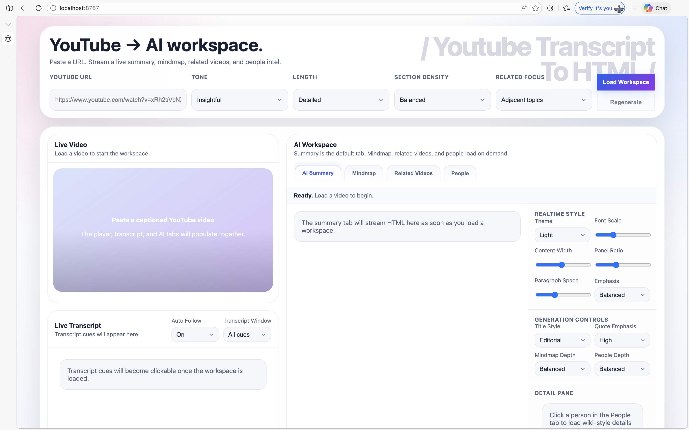
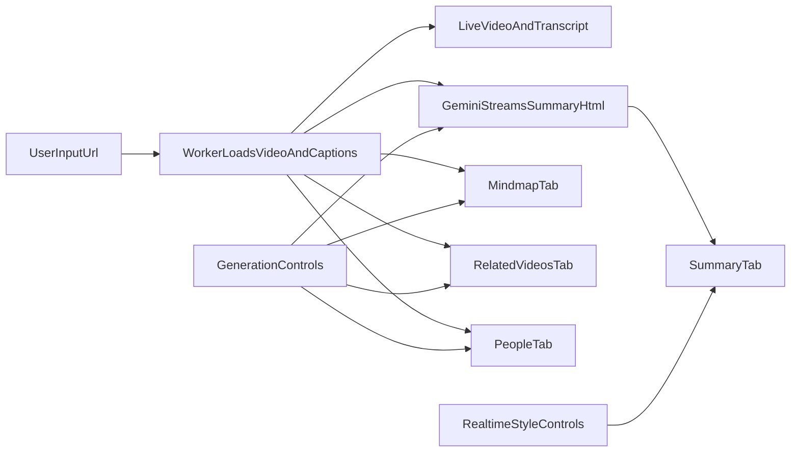

# YouTube Transcript To AI Notes


Turn a captioned YouTube video into a live analysis workspace on Cloudflare Workers.

The app loads the video, fetches captions, streams a Chinese editorial HTML summary, and lets the user move across a mindmap, related-videos panel, and people intelligence view with realtime layout and generation controls.

## Screenshots
### Workspace Layout



### Summary Style Baseline


## What It Ships
- A split-screen workspace inspired by modern AI document/video copilots.
- Upper-left live YouTube embed driven by the YouTube iframe API.
- Lower-left clickable transcript pane with cue-based seeking.
- Right-side tab system:
  - `AI Summary`: streamed Chinese editorial HTML.
  - `Mindmap`: transcript themes rendered as a hierarchy.
  - `Related Videos`: likely next-watch recommendations.
  - `People`: person cards, wiki/search links, and related videos.
- Realtime adjustment controls for theme, width, panel ratio, spacing, emphasis, and generation parameters.
- Cloudflare Worker deployment with a server-side Gemini integration.

## Experience Flow


## Product Surfaces
### `AI Summary`
- Streams partial HTML from Gemini as it is generated.
- Sanitizes the rendered summary client-side before display.
- Targets a premium editorial Chinese article style rather than a plain transcript dump.

### `Mindmap`
- Uses Gemini to produce structured JSON.
- Renders the result as a readable topic tree in the browser.

### `Related Videos`
- Pulls YouTube search candidates from the public search results page.
- Uses Gemini to rank those candidates into likely next-watch picks.
- Falls back to raw ranked candidates if AI ranking is unavailable.

### `People`
- Extracts notable people from the transcript with Gemini.
- Lets the user click a person card to load a detail panel.
- Enriches the detail view with Wikipedia summary data and related YouTube searches.

## Architecture
### Server
- `src/worker.js`: request routing and API surface.
- `src/lib/youtube.js`: YouTube ID parsing, watch-page parsing, caption extraction, search parsing.
- `src/lib/youtube-data-api.js`: optional [YouTube Data API v3](https://developers.google.com/youtube/v3) `captions.list` + `captions.download` (no `youtube.com/watch` scrape) when `YOUTUBE_KEY` and `YOUTUBE_ACCESS_TOKEN` are set.
- `src/lib/gemini.js`: Google Gemini streaming and JSON helpers.
- `src/lib/siliconflow.js`: optional [SiliconFlow](https://siliconflow.cn) `/v1/messages` for local dev when `AI_ENV=local`.
- `src/lib/llm.js`: routes between Gemini (default) and SiliconFlow for Worker requests.
- `src/lib/speaker-transcript.js`: baoyu-style speaker transcript prompt (`speaker-transcript.md` bundled as JSON).
- `src/lib/prompt.js`: prompt builders for summary and derived tabs.
- `src/lib/recommendations.js`: related-video ranking flow.
- `src/lib/people.js`: people extraction and detail enrichment.

### Client
- `src/ui/page.js`: HTML shell for the workspace.
- `src/ui/client.js`: tab switching, stream parsing, player sync, transcript seeking, realtime controls.
- `src/ui/styles.js`: glassy dashboard layout plus editorial article styling.

## Project Structure
```text
.
├── src/
│   ├── lib/
│   ├── ui/
│   └── worker.js
├── tests/
├── ref/
├── UPDATE_LOG/
├── package.json
└── wrangler.toml
```

